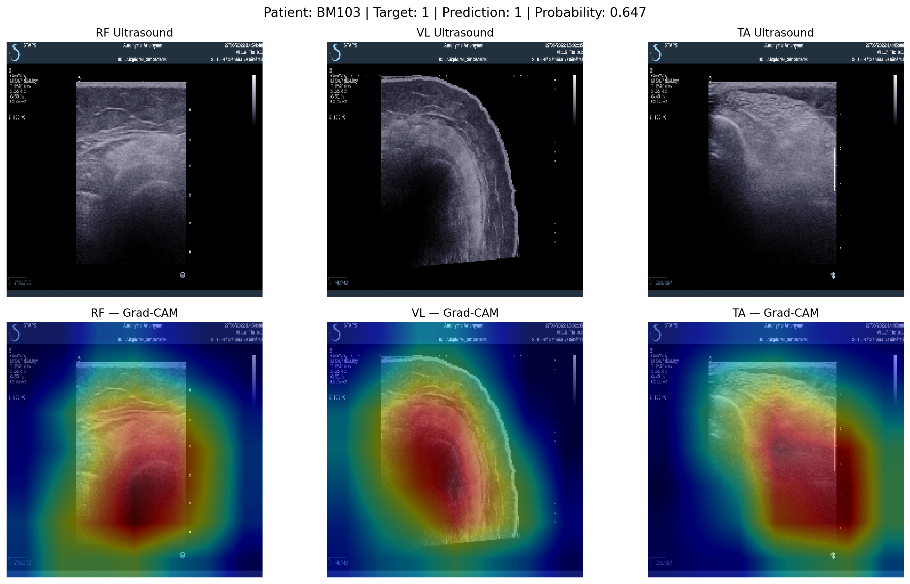

# SarcopeniaAI

**Explainable Multimodal AI for Muscle Health Assessment**

SarcopeniaAI is a PyTorch research project that combines **ultrasound
imaging from three muscle groups** with **basic clinical information**
to explore low-muscle-strength assessment.

The project was built as an end-to-end medical AI workflow: DICOM
processing, patient-level data splitting, image and clinical baselines,
multimodal fusion, held-out evaluation, Grad-CAM explainability, and
Streamlit deployment.

> **Important:** This is a research and educational prototype. It is
> **not clinically validated** and must not be used for diagnosis or
> treatment decisions.

------------------------------------------------------------------------

## Project Highlights

-   Multi-muscle ultrasound: **Rectus Femoris (RF), Vastus Lateralis
    (VL), Tibialis Anterior (TA)**
-   Clinical variables: **Age, Height, Weight, Sex**
-   Custom CNN ultrasound baseline
-   Pretrained **ResNet18** ultrasound model
-   Clinical **MLP** baseline
-   Multimodal **RF + VL + TA + clinical** fusion network
-   Patient-level train/validation/test splitting to prevent patient
    leakage
-   DICOM preprocessing and JPEG-Lossless decoding
-   Grad-CAM explainability for all three muscle inputs
-   Interactive Streamlit research demo
-   Explicit reporting of small-data and generalization limitations

------------------------------------------------------------------------

## System Workflow

``` text
RF Ultrasound ─┐
VL Ultrasound ─┼─> Shared ResNet18 Image Encoder ─> Image Representation ─┐
TA Ultrasound ─┘                                                          │
                                                                           ├─> Fusion ─> Binary Output
Age ───────────┐                                                          │
Height ────────┤                                                          │
Weight ────────┼─> Clinical MLP ────────────────> Clinical Representation ─┘
Sex ───────────┘
```

The output is an **experimental model probability for low muscle
strength**, not a clinical probability of sarcopenia.

------------------------------------------------------------------------

## Website Screenshots

Place your four screenshots inside:

``` text
assets/screenshots/
```

Use these exact filenames:

``` text
01_home.png
02_inputs.png
03_prediction.png
04_explainability.png
```

### 1. SarcopeniaAI Interface


### 2. Ultrasound and Clinical Inputs


### 3. Multimodal Assessment Result


### 4. Explainability / Grad-CAM


------------------------------------------------------------------------

## Data

The project uses the public **DATA_HuetJeremie_article** ultrasound
dataset.

The dataset contains ultrasound acquisitions from the:

-   **RF** --- Rectus Femoris
-   **VL** --- Vastus Lateralis
-   **TA** --- Tibialis Anterior

The working dataset contained **60 patients**. Multiple acquisitions
from the same patient were always kept within the same split to avoid
patient leakage.

Raw medical data are **not included in this repository**.

------------------------------------------------------------------------

## Research Target

The primary experimental target is **low muscle strength / probable
sarcopenia-related risk**, based on hand-grip strength thresholds.

Hand-grip strength itself is **not used as an input feature**, because
it defines the target and would cause target leakage.

The clinical branch therefore uses:

``` python
["Age", "Taille", "Poids", "Sexe"]
```

where the dataset variables correspond to age, height, weight, and sex.

------------------------------------------------------------------------

## Models

### 1. Custom CNN

A convolutional neural network built from scratch to establish an
ultrasound baseline.

### 2. ResNet18

A pretrained ResNet18 adapted for ultrasound binary classification.

### 3. Clinical MLP

A small multilayer perceptron trained using four non-leaking clinical
variables.

### 4. Multimodal Fusion Network

The main experimental architecture combines:

-   RF ultrasound
-   VL ultrasound
-   TA ultrasound
-   Clinical representation

The three ultrasound inputs are processed using a shared ResNet18
encoder. Their representations are combined and fused with the clinical
MLP representation before binary classification.

------------------------------------------------------------------------

## Explainability

Grad-CAM was implemented separately for:

-   RF
-   VL
-   TA

An example generated during the experiment is included below.



Grad-CAM indicates image regions that influence the neural network. It
**does not establish clinical causality**.

------------------------------------------------------------------------

## Experimental Results

The project intentionally reports the limitations of the trained models
rather than presenting accuracy alone.

  --------------------------------------------------------------------------
  Model             Validation ROC-AUC         Test ROC-AUC Important
                                                            Observation
  --------------- -------------------- -------------------- ----------------
  Custom CNN                       ---              0.550\* Image-level
                                                            baseline showed
                                                            class-collapse
                                                            behavior

  ResNet18                       0.647                0.500 Patient-level
                                                            test predictions
                                                            collapsed to the
                                                            positive class

  Clinical MLP                   0.611                  --- Weak ranking
                                                            signal on the
                                                            small validation
                                                            cohort

  Multimodal                     0.533                0.000 All 7 complete
  Fusion                                                    test patients
                                                            were predicted
                                                            positive
  --------------------------------------------------------------------------

\*The Custom CNN value is an **image-level test AUC**, not a
patient-level AUC.

### Final Multimodal Test

The final complete-case multimodal test subset contained only **7
patients**:

-   Accuracy: **0.714**
-   Precision: **0.714**
-   Sensitivity: **1.000**
-   Specificity: **0.000**
-   F1: **0.833**
-   ROC-AUC: **0.000**

The apparent 71.4% accuracy reflects the majority-positive composition
of this very small test subset. The model predicted every test patient
as positive, so the accuracy and F1 score must **not** be interpreted as
evidence of strong clinical performance.

This result demonstrates an important small-data medical-AI lesson:
**accuracy can be misleading under class imbalance and limited
patient-level sample size**.

------------------------------------------------------------------------

## Streamlit Application

The Streamlit interface accepts:

1.  RF ultrasound image
2.  VL ultrasound image
3.  TA ultrasound image
4.  Age
5.  Height
6.  Weight
7.  Sex

Supported image formats:

-   DICOM (`.dcm`)
-   PNG
-   JPG / JPEG

The interface returns an experimental model score and whether it falls
above or below the fixed **0.50 classification threshold**.

### Run Locally

``` bash
pip install -r requirements.txt
streamlit run app.py
```

------------------------------------------------------------------------

## Repository Structure

``` text
SarcopeniaAI/
│
├── app.py
├── README.md
├── MODEL_CARD.md
├── requirements.txt
├── config.json
├── RUN_APP.txt
├── .gitignore
│
├── notebooks/
│   └── SarcopeniaAI_PyTorch.ipynb
│
├── models/
│   ├── sarcopenia_multimodal_final.pth
│   └── clinical_scaler.pkl
│
├── assets/
│   ├── multimuscle_gradcam.png
│   └── screenshots/
│       ├── 01_home.png
│       ├── 02_inputs.png
│       ├── 03_prediction.png
│       └── 04_explainability.png
│
└── results/
    ├── model_comparison.csv
    ├── multimodal_test_predictions.csv
    └── inference_example.json
```

------------------------------------------------------------------------

## Tech Stack

-   Python
-   PyTorch
-   Torchvision
-   Streamlit
-   scikit-learn
-   pandas / NumPy
-   pydicom
-   pylibjpeg
-   Matplotlib
-   Grad-CAM
-   Google Colab

------------------------------------------------------------------------

## Key Engineering Decisions

**Patient-level splitting:** Images belonging to the same patient are
never intentionally distributed across training, validation, and test
sets.

**No target leakage:** Hand-grip strength defines the target and is
excluded from clinical model inputs.

**Multimodal learning:** Ultrasound and clinical representations are
learned separately and fused within one model.

**Transparent evaluation:** Specificity, ROC-AUC, confusion matrices,
class-collapse behavior, and cohort size are reported alongside
accuracy.

**Research-first deployment:** The Streamlit application is presented as
a demonstration of the ML pipeline, not as a medical product.

------------------------------------------------------------------------

## Limitations

-   Small patient cohort
-   Very small complete-case multimodal test set
-   Moderate target imbalance
-   No external validation cohort
-   Experimental sex coding should be verified against authoritative
    dataset documentation before any further clinical research use
-   Ultrasound acquisition and preprocessing may introduce scanner- or
    overlay-related shortcuts
-   The multimodal model showed poor held-out generalization
-   The model is not clinically validated

------------------------------------------------------------------------

## Future Work

Potential extensions include:

-   Larger multi-center patient cohorts
-   External validation
-   Explicit handling of repeated ultrasound acquisitions
-   Muscle-specific fusion instead of pooled muscle representations
-   Aspect-ratio-preserving ultrasound preprocessing
-   ROI/segmentation-guided analysis
-   Calibration and uncertainty estimation
-   Stronger patient-level imbalance handling
-   Prospective clinical evaluation

------------------------------------------------------------------------

## Author

**Fatima Noor**

Computer Science researcher working on computer vision, multimodal AI,
medical AI, and machine learning.

------------------------------------------------------------------------

## Disclaimer

This repository is provided for **research, education, and portfolio
demonstration only**.

SarcopeniaAI is **not a medical device**, has not undergone clinical
validation, and must not be used to diagnose sarcopenia, determine
treatment, or replace assessment by qualified healthcare professionals.
